# PDI - Segundo semestre de 2022

## As 10 Heurísticas de Nielsen
#### 1- Visibilidade do status do sistema
Em ambientes digitais dependemos quase que exclusivamente da nossa visão para compreendermos o que está acontecendo no sistema. Para tal, uma das maiores preocupações quanto à experiência do usuário deve ser a facilidade para o usuário saber qual é a sua posição dentro do sistema.

#### 2 - Compatibilidade entre o sistema e o mundo real
O sistema precisa falar a mesma língua do usuário, ou seja, os símbolos da interface precisam fazer sentido com a rotina do sistema, por exemplo.

#### 3 - Controle e liberdade para o usuário
Frequentemente o usuário pode realizar ações por engano, desta forma, o sistema deve ter uma maneira de “salvar” o usuário de seu engano. Um exemplo é o atalho “Ctrl+Z”, que restaura o último delete.

#### 4 - Consistência e padronização
A padronização e consistência entre as telas de um sistema  é essencial para qualquer aplicação. Isto torna a experiência do usuário muito mais interessante, já que irá facilitar o uso do sistema.

#### 5 - Prevenção de erros
A prevenção de erros é imprescindível e consiste na exibição de caixas de confirmação quando o usuário for realizar alguma ação específica, assim evita-se que o usuário realize ações sem querer das quais pode se arrepender.

#### 6 - Reconhecimento > memorização
É mais interessante que o usuário saiba o seu caminho dentro do sistema por meio do reconhecimento de padrões do que através de memorizações.

#### 7 - Eficiência e flexibilidade de uso
A interface da aplicação deve ser útil tanto para o usuário leigo quanto para o mais experiente.

#### 8 - Estética e design minimalista
Quanto menor a quantidade de informações irrelevantes existirem na tela, mais fácil fica a utilização do sistema. Sendo assim, torna-se de extrema importância manter na tela apenas as informações que são realmente necessárias.

#### 9 - Reconhecimento e diagnóstico de erros pelo usuário
Outro ponto de extrema relevância é ajudar o usuário a entender o erro cometido. Como exemplo temos a exibição da mensagem “Acesso negado! Credenciais inválidas.” ao errar a senha ou usuário para logar no Voors.

#### 10 - Documentação
Apesar de não serem tão acessadas pelos usuários, nas documentações podemos explicar o funcionamento e detalhar todos os passos para utilização do sistema. Desta forma, podemos tornar os usuários independentes do suporte.

## SOLID
### Single Responsibility Principle
Uma classe deve ter apenas uma responsabilidade, apenas um motivo para ser alterada.

### Open Closed Principle
Uma classe deve estar aberta para extensão e fechada para modificação;
Não há necessidade de aumentar o tamanho de uma classe, ao invés disso criar uma base para a classe e caso necessite de uma feat, apenas estender a base.	

### Liskov Substitution Principle
Subclasses podem ser substituídas pelas suas classes pai:
A subclasse deve ter a capacidade de ser utilizada em qualquer momento no lugar da classe pai.
Se caminha como um pato, fala como um pato e parece um pato, mas precisa de pilhas. Então não é um pato.	

### Interface Segregation Principle
Uma classe não é obrigada a implementar interfaces que ela não irá utilizar.
Segregue suas interfaces!

### Dependency Inversion Principle
Dependa de abstrações e não de implementações;

Exemplo implementação:  
  `const movie = new movie();`	

Exemplo de abstração:  
  `class DramaCategory implements Category {};`  
  `const movie = new movie(“name”, new DramaCategory());`
  
## DOCKER
O container é leve pois não contém todo o SO, apenas o necessário.
O container é imutável, o que você alterar será restaurado.

### Imagens
Trabalham com camadas de acordo com a necessidade para a aplicação.

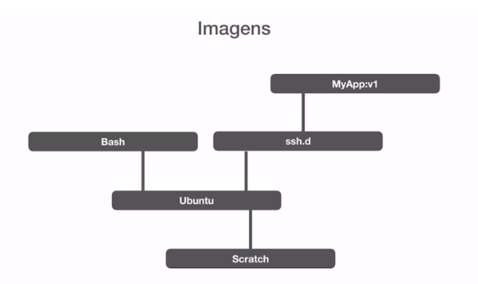

Sendo assim, a imagem é um conjunto de dependências encadeadas numa árvore de necessidade da aplicação.

### Dockerfile
Arquivo declarativo que é usado para CONSTRUIR imagens:
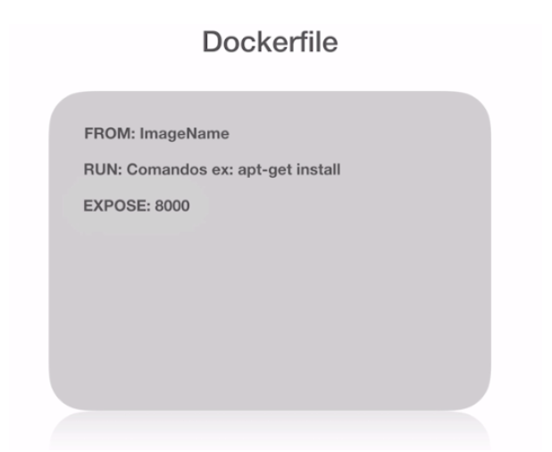

### Formas de alterar uma imagem:
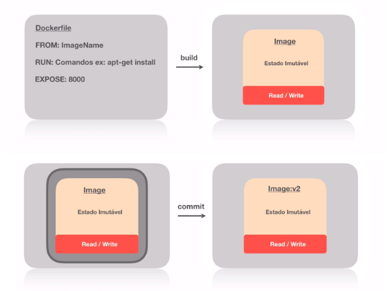

### Resumo sobre containeres Docker:
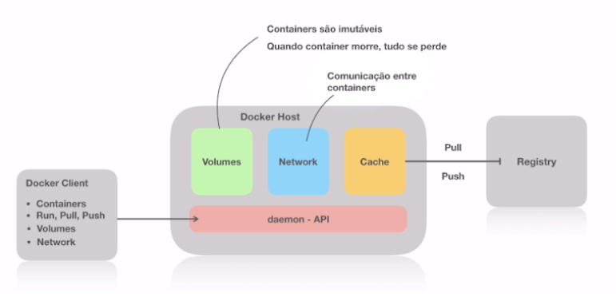

### Bind Mounts
O bind é uma forma de "anexar" o container em um source, ex: ` --mount type=bind, source=”$(pwd)”`. Porém os Bind Mounts estão depreciados,
já que há a possibilidade de utilizar o "-v":
`docker run -d -p 8080:80 nginx -v`

A diferença entre o -v e o --mount é que o -v cria a pasta na máquina caso ela não exista, o mount não.

### Volumes
Um volume pode ser criado previamente para o armanezamento de uma imagem, o mesmo pode ser utilizado no lugar dos Bind Mounts;  
É possível compartilhar o mesmo volume entre diferentes containers.

### Criação de imagens
Ao criar uma imagem nós a enviamos para o registry do docker, o Dockerhub.
Para tal, basta vincular o comando `docker build -t [usuario]/[imagem]:[versão]`

### Network
A network é a comunicação entre containeres que estão na mesma rede.

#### Tipos de network:
	- bridge -> comunicação básica entre dois contêineres, ponte
	- host -> abre a porta do pc ao container e vice-versa
	- overlay -> comunicação entre contêineres em diferentes máquinas
	- macvlan -> mac address
	- none -> sem rede

## GitOps (GitFlow)
O GitOps consiste em metodologias de versionamento e automatização para trazer uma maior consistência e inteligibilidade ao código.
### Tipos de ramificações (branch):
  - Master -> Branch de Produção;
  - Develop -> Esta ramificação deve conter o histórico completo do projeto, enquanto a Master possui uma versão “abreviada”;
  - Feature -> Cada recurso novo que for acrescentado deve ser criado através de ramificações específicas e após a conclusão, ocorre o merge na ramificação Develop;
  - Release -> Uma vez que a branch Develop está pronta para ser enviada para produção, ocorre uma bifurcação da branch Develop em que se dá o processo de lançamento da versão;
  - Hotfix -> Ramificação de manutenção que  é utilizada para corrigir eventuais bugs e após a correção é mergido na Develop e Master.

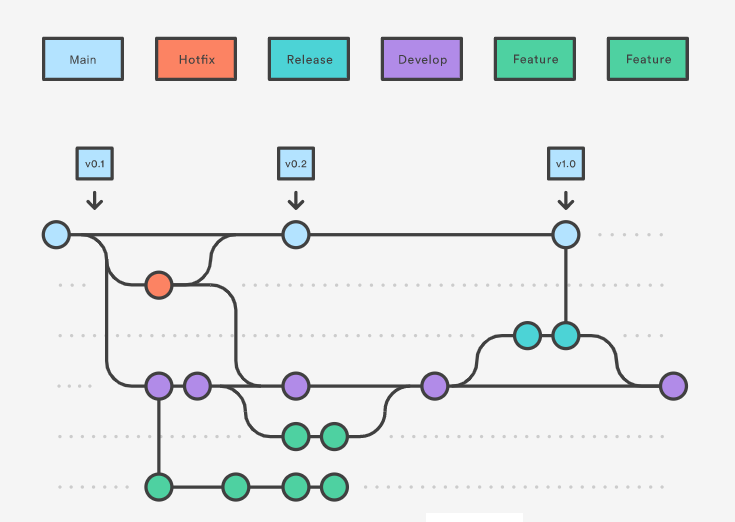

### Assinatura de Commits
Todas as vezes que for feito um commit será realizado uma verificação da sua chave pública, a que está no github/bitbucket/gitlab,  e privada, a que está armazenada localmente. Se ambas forem iguais, o commit é assinado. Este processo serve para obter segurança na assinatura dos commit, e assim, evitar que se passem por você. 
Para tal, se torna necessário o uso de chaves GPG ou GNU Privacy Guard, estas irão proporcionar as assinaturas públicas e privadas e a sua verificação.

### Protegendo Branches
É de extrema importância ter uma forma de proteger a ramificação de produção, já que a possibilidade de ocorrerem commits diretamente nas branches deve ser inibida, ao passo que ao trabalhar com Pull Requests nos possibilita realizar Code Reviews, além de trazer mais uma camada de segurança para a aplicação.

### Semantical Versioning
“No mundo de gerenciamento de software existe algo terrível conhecido como inferno das dependências (“dependency hell”). Quanto mais o sistema cresce, e mais pacotes são adicionados a ele, maior será a possibilidade de, um dia, você encontrar-se neste poço de desespero”

O excerto acima foi retirado do próprio site do SemVer [https://semver.org/lang/pt-BR/] e é justamente para evitar este problema que o versionamento semântico foi criado.

Existem três fatores que definem a versão de uma aplicação que trabalha com semantical versioning:
  - Maior(MAJOR): quando fizer mudanças incompatíveis na API,
  - Menor(MINOR): quando adicionar funcionalidades mantendo compatibilidade,
  - Correção(PATCH): quando corrigir falhas mantendo compatibilidade.

Exemplo: MAJOR.MINOR.PATCH = 3.1.5.

### Convencional Commits 
Os convencional commits nos ajudam a entender o motivo do commit ter sido realizado.  
De acordo com o padrão Voors, temos as seguintes convenções para prefixo da mensagem do commit:
  - Feat: Usado ao adicionar funcionalidades
  - Style: Usado em alterações de estilo
  - Refactor: Usado para a reescrita de um código
  - Hotfix: Usado para correções de erros no código

## Arquitetura do Projeto Prático (streaming de vídeos)
### Funcionalidades:
Assinatura do serviço pelo cliente;  
Catálogo de vídeos para navegação;  
Playback de vídeos;  
Busca full text no catálogo;  
Processamento e encoding dos vídeos;  
Administração do serviço de assinatura;  
Autenticação;

### Microsserviços:
Tecnologia adequada para cada contexto (ex: Go para processar vídeos);  
Não existe uma verdade absoluta na escolha de tecnologias;  
Microsserviços podem ser substituídos por outros com tecnologias diferentes;  
Cada microsserviço terá seu próprio processo de CI/CD;

### Escalabilidade:
Kubernetes;  
O processo de escala poderá ser configurado a nível de microsserviço;  
Todos os microsserviços trabalharão de forma “Stateless”--> efêmero;  
Quando utilizado upload de assets, o mesmo será armazenado em um cloud;  
O processo de escala se dará no aumento na qntd de PODs do Kubernetes;  
O autoscaling também será utilizado através de um recurso chamado HPA (horizontal pod autoscaler);

### Service Discovery
Não há necessidade de trabalhar com sistema de Service Discovery separado (Consul);  
O Kubernetes já tem este processo integrado;

### Consistência Eventual
Grande parte da comunicação entre os microsserviços será assíncrona;  
Cada microsserviço terá um banco de dados separado;  
Dados podem ficar inconsistentes, desde que não haja prejuízo (milissegundos);

### Duplicação de Dados
Caso surja a necessidade, pode haver duplicação de dados em diferentes bancos de dados, já que um banco pode servir melhor para um propósito do que outro (elasticsearch);  
Deixa o microsserviço autônomo;  
Duplicar apenas o necessário para não criar um monstro;  
Kafka Connect para replicar os dados;

### Mensageria
RabbitMQ (não vai ser usado o kafka pq seria como matar uma formiga c/ uma bazuca);  
Já que a comunicação entre os microsserviços é assíncrona, um sistema de mensageria se torna muito útil;

### Resiliência e Self Healing
Filas! Caso o microsserviço fique fora do ar, uma fila irá aguardar com que ele volte para continuar o processamento de onde parou;  
Mensagens de padrão errôneo podem ser rejeitadas pelo microsserviço e armazenadas numa dead-letter queue, ou seja, fila de mensagens de erro;  
Circuit Breaker, Liveness e Readiness;

### Autenticação
Serviço centralizado de identidade: Keycloak;  
OpenID Connect;  
Customização do tema: create-react-app;  
Compartilhamento de chave pública com os serviços para verificação de token;  
ACL;  
Flow de autenticação p/ front e back;

### Quais serão os microsserviços
Backend Admin do catálogo de vídeos (mysql);  
Frontend Admin do catálogo de vídeos;  
Encoder;  
Backend API do catálogo (elasticsearch);  
Frontend do catálogo;  
Assinatura pelo cliente;  
Autenticação entre microsserviços Keycloak;  
Comunicação assíncrona entre microsserviços com RabbitMQ;  
Replicação de dados utilizando Apacha Kafka e Kafka Connect;

#### Admin do Catálogo:
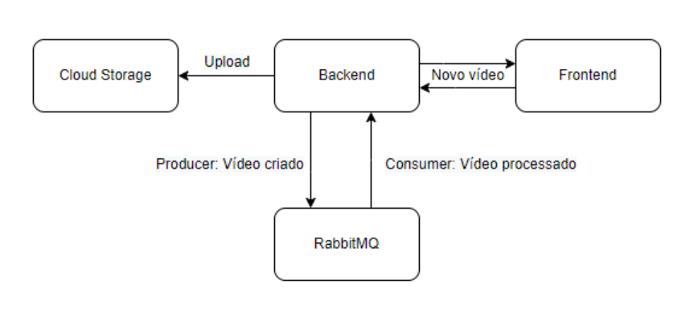

#### Encoder de Vídeos:
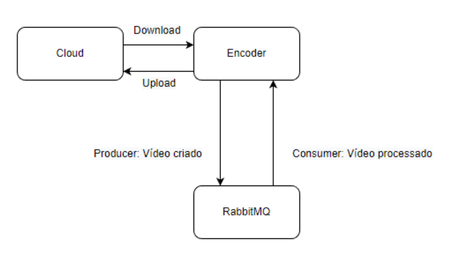

#### API/App do Catálogo:
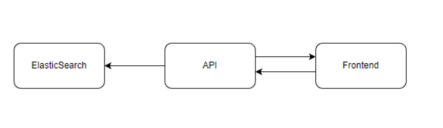

#### Assinatura:
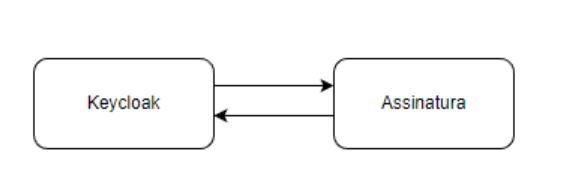

#### Microsserviço de Autenticação:
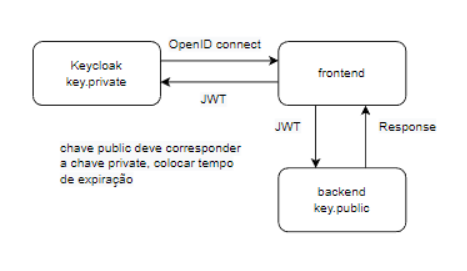

#### Dinâmica Geral dos Microsserviços:
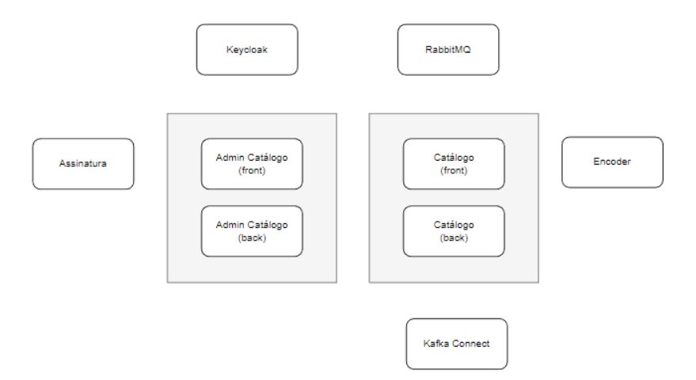

### Ambiente de Desenvolvimento:
Docker pra tudo: rápido, ambientes correspondentes, gerar builds etc

#### CI/CD
- Para cada PR iniciaremos o processo de CI
- Github actions
- O CI será capaz de:
    - subir a aplicação Docker
    - Executar testes
    - Utilizar Sonarqube
- No merge da PR, o processo de CD acontece
- Geração de imagem Docker
- Upload da imagem no registry
- Executará o deploy no Kubernetes

#### Kubernetes 
- Cluster Kubernetes gerenciado
- O deploy do app
- Startup, Readiness e Liveness Probe para self healing
- Horizontal Pod Autoscaler (HPA)

#### Cloud Providers
- IaC (Infra as Code):
    - Terraform
    - Ansible
- Providers
    - AWS
    - GCP
  - Azure
